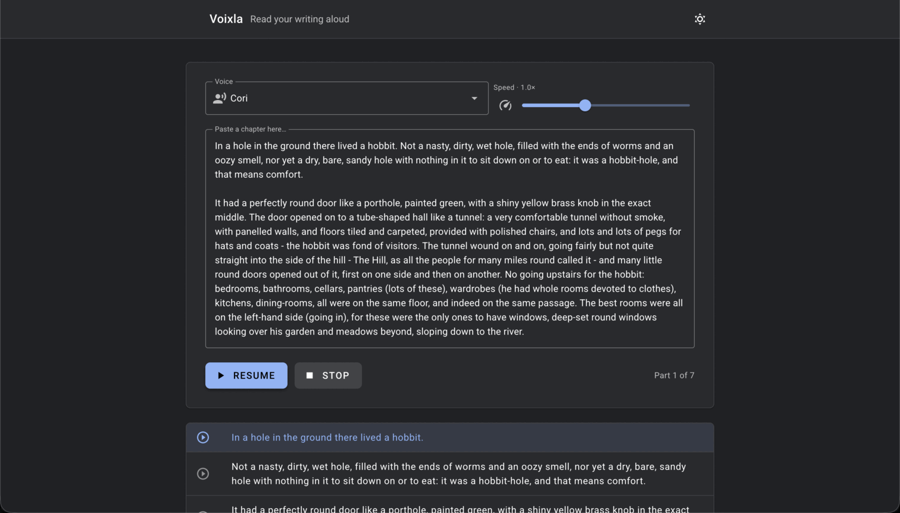

# Voixla 
*(a play on “voilà” and “voix,” the French word for “voice”)*

A self-hosted, fully local text-to-speech web app. Paste some text, pick a voice, and have
it read back to you. 



## Stack

- **Engine ([piper-tts](https://pypi.org/project/piper-tts/))**
- **Backend (.NET 10)** 
- **Frontend (Vue 3 + Vite)**

### API

| Method | Route                   | Purpose                              |
| ------ | ----------------------- | ------------------------------------ |
| GET    | `/api/voices`           | List installed voices                |
| POST   | `/api/prepare`          | Split text into playable chunks      |
| GET    | `/api/audio/{hash}.wav` | Synthesise (or serve cached) a chunk |
| GET    | `/api/health`           | Health check                         |

## Develop

```bash
# One-time: install the TTS engine and some voices
python3 -m venv .venv-piper && .venv-piper/bin/pip install piper-tts
./scripts/download-voices.sh backend/voices

# Backend (terminal 1)
cd backend && dotnet run

# Frontend (terminal 2)
cd frontend && npm install && npm run dev
```

The frontend runs on `http://localhost:5174` and proxies the API to the backend on `:5005`.

## Deploy (Docker)

```bash
docker compose up -d --build
```

Then open `http://<host>:5005`. Starter voices are baked in for offline use, and the audio
cache is ephemeral. To host under a sub-path behind a reverse proxy, build with
`--build-arg BASE_PATH=/your-path`. A non-Docker setup is also available via
`scripts/setup-pi.sh`.

## Voices

Browse and preview voices at
[rhasspy.github.io/piper-samples](https://rhasspy.github.io/piper-samples/), then add more
by editing the `VOICES` list in `scripts/download-voices.sh`. The medium and high quality
tiers sound best for long reading. Voice licences vary, so check terms before redistributing.

## Notes

- Local TTS is fast and private, but sounds more synthetic than large cloud models. Try a
  few voices to find one you like.
- Tunables (concurrency, cache size and TTL, chunk size) live in `backend/appsettings.json`.
- Cached audio is safe to delete; it regenerates on demand.